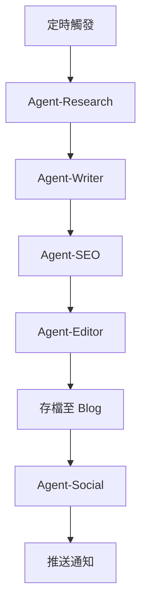

# 自動內容更新系統

## 目標
讓 Blog 網站持續更新新內容，達成每日至少 1-2 篇新文章。

## 更新策略

### 每日內容計畫
| 星期 | 主題類型 | 目標關鍵字 |
|------|----------|-----------|
| 一 | ETF 分析 | ETF推薦, 績效比較 |
| 二 | 投資心法 | 定期定額, 資產配置 |
| 三 | 市場觀點 | 台股分析, 美股趨勢 |
| 四 | 理財規劃 | 退休理財, 被動收入 |
| 五 | 新手教學 | 投資入門, 開戶教學 |
| 六 | 週報回顧 | 本週市場, 下週展望 |
| 日 | 專題深度 | 長篇分析, 比較文 |

---

## 自動化流程

### 每 6 小時執行一次



---

## 內容主題庫

### ETF 相關（20 題目）
1. 2026年必看的5檔高股息ETF
2. VOO vs QQQ 哪個更適合長期投資？
3. 台股ETF完全指南：0050、006208、00878比較
4. 半導體ETF投資攻略：SMH vs 00891
5. ESG ETF是什麼？綠色投資入門
6. 債券ETF投資時機分析
7. ETF配息怎麼算？除息日全攻略
8. 複委託買美國ETF的費用比較
9. ETF vs 基金：10個關鍵差異
10. 初學者如何建立ETF投資組合
11. 台灣50 ETF十年績效回顧
12. 高股息ETF的除息旺季策略
13. 科技股ETF的風險與機會
14. REITs ETF：不動產投資入門
15. 原物料ETF投資指南
16. 量子計算ETF：未來科技投資
17. 電動車ETF：TSLA之外的选择
18. 0050 vs 006208：台股旗艦ETF對決
19. S&P500 ETF：VOO、SPY、IVV比較
20. 如何用ETF實現財務自由

### 投資心法（15 題目）
1. 定期定額vs單筆投資：哪個更好？
2. 資產配置黃金比例：60/40法則
3. 什麼是平均成本法？
4. 投資紀律：如何克服貪婪與恐懼
5. 新手投資常見的10個錯誤
6. 何時該停利？出場時機判斷
7. 下跌時該加碼還是停損？
8. 投資心理學：行為財務學入門
9. 如何設定投資目標？
10. 被動投資vs主動投資
11. 再平衡策略：何時調整配置
12. 複利的力量：時間是最好的朋友
13. 長期投資的真正含義
14. 投資組合風險評估方法
15. 如何建立自己的投資SOP

### 市場分析（10 題目）
1. 2026年台股展望
2. 美國利率政策對台股的影響
3. AI產業鏈投資地圖
4. 半導體週期分析
5. 台積電財報解讀
6. 美股財報季關注重點
7. 中國股市對台股的影響
8. 匯率變化對投資的影響
9. 通膨數據如何解讀
10. 技術分析入門：K線圖基礎

---

## 執行模式

### 模式 A：背景自動執行
```bash
# 每6小時自動產生新文章
*/6 * * * * openclaw agent-run --task "generate-daily-content"
```

### 模式 B：手動觸發
使用者可隨時要求「產生新文章」

### 模式 C：智慧排程
根據熱門時段（早上9點、晚上8點）自動發布
